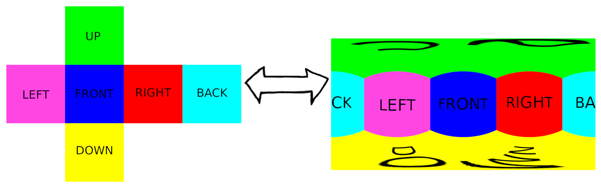

This is a simple command line program that changes the projection of textures.

You can transform from cubemap to latlong (also know as equirectangular), and viceversa.



### Download the executable

### Usage

There are 2 kinds of command:
```
reproject latlongToCubemap <inputFile> <outputFile> <outputFaceResolution> [numSamples]
reproject cubemapToLatlong <inputFile> <outputFile> <outputWidth>x<outputHeight> [numSamples]
```

The number of samples is optional. The more the better quality (at the expense of more computation cost). The default value is 128, which is usually more that enough.

Examples:

```
$ ./reproject latlongToCubemap myLatlong.hdr newCubemap.hdr 512

$ ./reproject cubemapToLatlong myCubemap.png newLatlong.png 2048x1024 1000
```

### Supported formats
This project uses [stb](https://github.com/nothings/stb) for loading and saving images.
- [Formats you can load](https://github.com/tuket/reproject/blob/e1550e9a591ef4e679c74727c86f45fa73a90a08/libs/stb/stb_image.h#L19)
- [Formats you can save](https://github.com/tuket/reproject/blob/e1550e9a591ef4e679c74727c86f45fa73a90a08/libs/stb/stb_image_write.h#L45)


